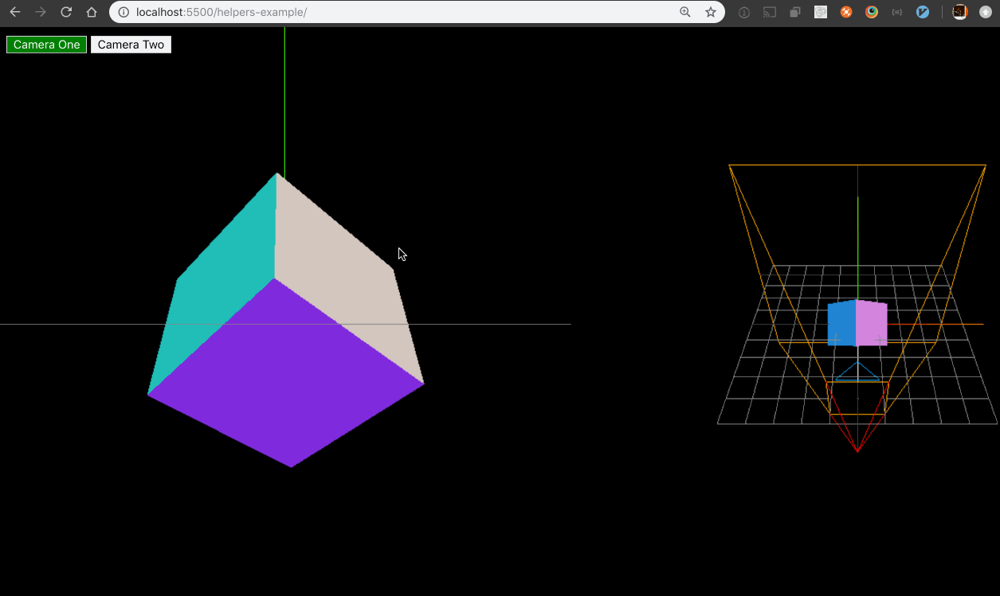

# Threejs Overview Talk

I'm giving a talk on [threejs](https://threejs.org) at November's [jSTL](https://www.meetup.com/jstl-meetup/) meetup.

[The slide deck can be found here.](https://app.ludus.one/9ba324c2-342b-4ce2-97c2-12326dde8873)

## Demos

There are two _heavily_ annotated demos in this repository:

- [basic demo](https://github.com/chris-schmitz/jstl-threejs-overview-talk/tree/master/basic-example)
- [helpers demo](https://github.com/chris-schmitz/jstl-threejs-overview-talk/tree/master/helpers-example)

In an effort to keep it simple both of these demos are writen in an imparitive and procedural style. With more complex projects you'll want to consider a more modularized and/or object oriented approach. I also didn't worry about handling fallback logic for browser support either for threejs or for es6 code.

All this to say: theses are def meant to be demos to show off some of the basic tools and ideas in threejs, don't necessarily take it to be the coding style you should use.

## Better comments

The annotated notes in the javascript files are colored using the [Better Comments](https://marketplace.visualstudio.com/items?itemName=aaron-bond.better-comments) extensiona for vs code. This is what allows me to type `// ! bla bla bla` and turn the text folling it red.

If you're a VSCode user I highly suggest installing the Better Comments library so you get that good comment coloring.
