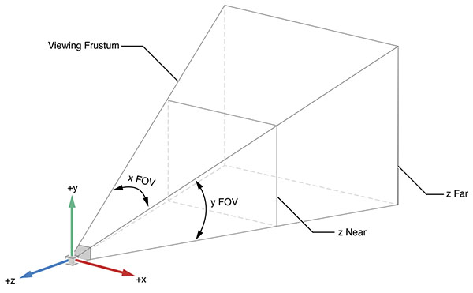

# Threejs

# REMEMBER TO TAKE GOOGLE CARDBOARD

# For each slide section, show an animation of one of the dancers as the slide background

# Intro slide

- Who I am
- Specifically not a designer

## What is it

Three.js aims to be a lightweight easy to use 3D library for web development.

At an ultra basic level, it's a library that makes working with WebGL easier.

## What is WebGL

WebGL is a javascript API implemented by all browsers for rendering interactive 2D and 3D graphics.

It allows you to access your computer's graphics hardware from your browser.

## Why do 3D in the browser vs native?

- Leverage existing web knowledge
- Easier delivery / Lower barrier to entry
- More accessible to average user
- Can be integrated into an greater web experience

## Note: Three.js can be used for 2D, but we'll be covering 3D

- _Add 2d examples as background_

## Parts of a three.js experience

**NOTE** that the [three.js examples](https://threejs.org/examples) are a great way of learning about the parts.

- See a live example of the tool
- Link to source directly on example

### The canvas

-

### Scene

### Camera

- Axis'
- Frustrum
- 

## renderer

- Different types of renderers available
- some of these renderers can be used as fallbacks for older browsers

## Creating 3D objects

- Geometry
- Material
- Mesh

## Animating

- [Request Animation frame](https://developer.mozilla.org/en-US/docs/Web/API/window/requestAnimationFrame): a hook into the browser's repaint cycle - Note that request animation frame will pause itself when the user goes to another tab or window

## Dev tools

## Helpers

-

## A weird note about tooling

- Some of the tooling

## Orbit controls

## Mention recasting

# Devices

- Mobile vs desktop
- Know what devices you're going to be on
- Test frequently - Criteria1 - criteria2

## VR Headsets

- With an additional library called [StereoEffects](https://github.com/mrdoob/three.js/blob/master/examples/js/effects/StereoEffect.js) you can create a stereoscopic view to create a 3d experience
- [codepen demo](https://codepen.io/kyolee310/pen/bpeRmm)
- [PCVR](http://vr.pc1.fun/)

## WebVR

- [A javascript API that supports virtual reality devices and cell phones]()
- Goals: - Detect available Virtual Reality devices. - Query the devices capabilities. - Poll the device’s position and orientation. - Display imagery on the device at the appropriate frame rate.
- WebVR handles the controls; the 3D experience can be built with three.js (or alternatives)

## Snags we ran into

- Performance on phones - Less on three.js, more on the video content we tried to use
- Dynamic fonts in VR - [outline of a good approach from google](https://developers.google.com/web/showcase/2017/within)
- Dev cycle in WebVR - Again, less three and more building a web experience in the oculus go - [screen mirroring tool vysor](https://www.vysor.io/)

# Examples

- [ddance party](https://dddance.party/)
- [cassini's grand tour](https://www.nationalgeographic.com/science/2017/09/cassini-saturn-nasa-3d-grand-tour/)
- [star tour](http://stars.chromeexperiments.com/)
- [cube slam](https://www.cubeslam.com/lrevyq)
- Paradowski tour: http://vr.pc1.fun/
- Graybar vid

# Alternatives and complements

- [babylon js ](https://www.babylonjs.com/)
- [paper js(2D)](http://paperjs.org/)
- [playcanvas](https://playcanvas.com/)
- [aframe](https://aframe.io/)

# Further exploration

- [three's website](https://threejs.org/)
- [three's examples](https://threejs.org/examples/)
- [an introduction to three.js](https://humaan.com/blog/web-3d-graphics-using-three-js/)
